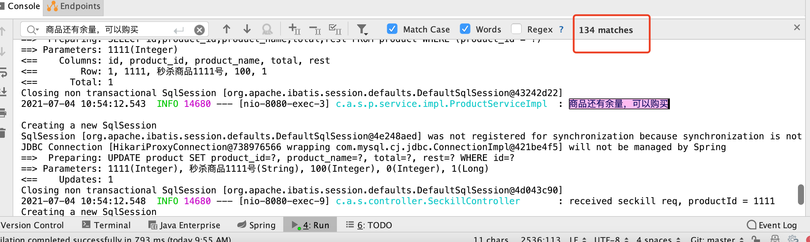

# 基础信息

- spring-boot：2.5.2
- mybatis-plus：3.4.3
- mysql：8.0.25
- jmeter：5.4.1
- vm配置：-Xmx500m -Xms500m -Xmn150m -XX:MetaspaceSize=200m -XX:+HeapDumpOnOutOfMemoryError -XX:HeapDumpPath=/app/dump -XX:+PrintGCDetails -XX:+PrintGCTimeStamps -XX:+PrintGCDateStamps -XX:+UseG1GC -Xloggc:/Users/wangquanzhou/ideaProj/seckill/gc.log

# tag 1.0 版本

完成了最基本的商品秒杀功能，并且没有做任何的并发控制。

## 测试过程

使用jmeter往`http://127.0.0.1:8080/seckill/1111`发请求，`

jmeter测试参数及结果：

| 线程数        | 启动时间(秒)   |  是否正常  |
| --------   | :-----:  | :----:  |
| 150     | 5 |   是，余量为0     |
| 150        |   4   |   是，余量为0   |
| 150        |    3    |  是，余量为0  |
| 150        |    2    |  是，余量为0  |
| 150        |    1    |  否，余量为40  |

从测试结果看有两点需要注意：
- 当线程数150，1秒启动所有线程的情况下，秒杀会出现问题，且不是超卖，而是`少卖`了，这是为何呢？
- 其他情况，虽然显示余量为0了，但是是不是意味着真的只有100人（商品总量为100）抢到了商品呢？

## 结果分析

针对上面提出的两个问题，我们分析一下原因。这里重申一下，tag1.0版本我们没有采取任何防并发的措施。

### 为什么会少卖

首先确认数据库的隔离级别是`REPEATABLE-READ`，mysql会采用快照读（snapshot）的方式，这是出现这个问题的根本原因。

举个例子，假如有A、B两个线程，A读取到商品余量为100，然后减1，更新到数据库，此时A还未commit。B线程此时读取商品余量，
由于snapshot的应用，也是100，同样的减1，更新到数据库，

相当于mysql被更新了两次，但是都是从100更新到99。所以才会出现`少卖`的情况。

### 是不是真的只有100人抢到

通过搜索日志，我们发现，`商品还有余量，可以购买`这句日志被打印了134次，说明有134个人抢购成功了，出现了`超卖`的情况，
但是却没有出现商品余量小于0的情况。这是为何？



分析一下抢购的源码，如下所示：
```java
        LambdaQueryWrapper<Product> wrapper = new LambdaQueryWrapper<Product>().eq(Product::getProductId, productId);
        Product product = productDao.selectOne(wrapper);

        if (null == product || product.getRest() <= 0) {
            log.info("商品不存在或者已经卖完");
            return Boolean.FALSE;
        }

        log.info("商品还有余量，可以购买 \n");
        product.setRest(product.getRest() - 1);
        productDao.updateById(product);

        return Boolean.TRUE;
```

还是以A、B线程为例，假设现在数据库余量为1，A线程读取商品余量为1，if语句可以通过，然后执行减1的操作，更新到数据库，但是还未commit；
B线程此时由于mysql snapshot的存在，读取到的余量也为1，同样执行减1操作，1-1=0，因此不会出现小于0的情况。

## 性能统计

经过反复多次尝试，使用300个线程，1秒启动，tps大概在200左右。


# tag 2.0 版本

为了解决1.0版本的`少卖`、`超卖`问题，我们需要对代码做点修改，最简单的办法就是加锁，有两种方案：
- 代码加锁
- 数据库加锁

## 代码加锁

最简单的办法就是在秒杀的核心代码上加`synchronized`关键字，如下所示：
```java
public synchronized Boolean sell(Integer productId) {

        LambdaQueryWrapper<Product> wrapper = new LambdaQueryWrapper<Product>().eq(Product::getProductId, productId);
        Product product = productDao.selectOne(wrapper);

        if (null == product || product.getRest() <= 0) {
            log.info("商品不存在或者已经卖完");
            return Boolean.FALSE;
        }

        log.info("商品还有余量，可以购买 \n");
        product.setRest(product.getRest() - 1);
        productDao.updateById(product);

        return Boolean.TRUE;
    }
```

虽然可以解决并发安全问题，但是这无疑也会使新根极具下降，使用300个线程，1秒启动，tps大概只有100左右，与不加锁时相比，直接下降了一半。


